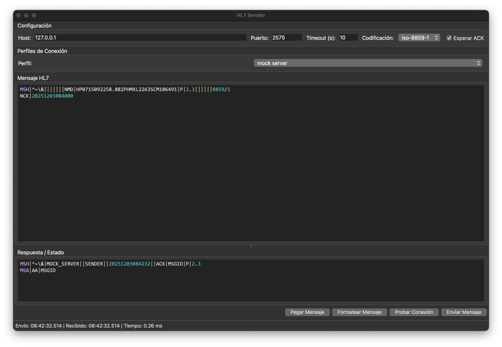

# HL7 Sender

Una aplicación de escritorio moderna para enviar y probar mensajes HL7 a través del protocolo MLLP (Minimal Lower Layer Protocol).




## 🌟 Características

- **Envío de mensajes HL7** a través de MLLP con soporte para ACK/NACK
- **Resaltado de sintaxis** para mensajes HL7
- **Perfiles de conexión** para gestionar múltiples destinos
- **Modo oscuro y claro** para mejor ergonomía visual
- **Soporte multiidioma** (Español e Inglés)
- **Formateo automático** de mensajes HL7
- **Múltiples codificaciones** (UTF-8, ISO-8859-1, CP1252, ASCII)
- **Test de conectividad** antes del envío
- **Interfaz intuitiva** con PyQt6

## 📋 Requisitos Previos

- Python 3.8 o superior
- PyQt6

## 🚀 Instalación

### Clonar el repositorio

```bash
git clone https://github.com/vchaccl-tech/hl7-sender.git
cd hl7-sender
```

### Crear entorno virtual (recomendado)

**macOS/Linux:**
```bash
python3 -m venv venv
source venv/bin/activate
```

**Windows:**
```bash
python -m venv venv
venv\Scripts\activate
```

### Instalar dependencias

```bash
pip install -r requirements.txt
```

## 💻 Uso

### Ejecutar la aplicación

```bash
python hl7_sender.py
```

O usar el script de ejecución (macOS/Linux):

```bash
chmod +x run.sh
./run.sh
```

### Servidor de Prueba

El proyecto incluye un servidor mock para pruebas locales:

```bash
python mock_server.py
```

El servidor escucha en `0.0.0.0:2575` por defecto y responde con ACKs a los mensajes HL7 recibidos.

## 📖 Guía de Uso

1. **Configurar conexión**: Introduce el host, puerto, timeout y codificación
2. **Crear perfiles**: Guarda configuraciones frecuentes para reutilizarlas
3. **Escribir mensaje**: Escribe o pega tu mensaje HL7
4. **Probar conexión**: Verifica que el servidor esté disponible
5. **Enviar mensaje**: Envía el mensaje y recibe la respuesta ACK/NACK

### Atajos de Teclado

- `Ctrl+O`: Cargar mensaje desde archivo
- `Ctrl+V`: Pegar desde portapapeles
- `Ctrl+F`: Formatear mensaje
- `Ctrl+T`: Probar conexión
- `Ctrl+Enter`: Enviar mensaje
- `Ctrl+S`: Guardar perfil
- `Ctrl+D`: Eliminar perfil
- `Ctrl+Q`: Salir

## 🎨 Características Destacadas

### Resaltado de Sintaxis HL7

Los mensajes HL7 se muestran con resaltado de sintaxis para facilitar la lectura:
- Segmentos en **púrpura** (MSH, PID, OBR, etc.)
- Números en **rosa/cyan**
- Separadores en **gris/amarillo**

### Perfiles de Conexión

Guarda y gestiona múltiples configuraciones para diferentes ambientes (desarrollo, QA, producción).

### Modo Oscuro

Interfaz adaptable con temas claro y oscuro para reducir la fatiga visual.

## 🛠️ Desarrollo

### Estructura del Proyecto

```
hl7-sender/
├── hl7_sender.py      # Aplicación principal
├── mock_server.py     # Servidor de prueba
├── run.sh             # Script de ejecución
├── requirements.txt   # Dependencias
├── LICENSE            # Licencia GPL-3.0
└── README.md          # Este archivo
```

### Configuración

La aplicación guarda su configuración en:
- **macOS**: `~/Library/Application Support/HL7Sender/hl7_sender_settings.json`
- **Windows**: `%APPDATA%/HL7Sender/hl7_sender_settings.json`
- **Linux**: `~/.config/HL7Sender/hl7_sender_settings.json`

## 📝 Licencia

Este proyecto está licenciado bajo la Licencia Pública General de GNU v3.0 - ver el archivo [LICENSE](LICENSE) para más detalles.

## 🤝 Contribuciones

Las contribuciones son bienvenidas. Por favor:

1. Fork el proyecto
2. Crea una rama para tu feature (`git checkout -b feature/AmazingFeature`)
3. Commit tus cambios (`git commit -m 'Add some AmazingFeature'`)
4. Push a la rama (`git push origin feature/AmazingFeature`)
5. Abre un Pull Request

## 🐛 Reportar Problemas

Si encuentras un bug o tienes una sugerencia, por favor abre un [issue](https://github.com/vchaccl-tech/hl7-sender/issues).

## ✨ Autor

Desarrollado por vchac y Antigravity by Google

## 🙏 Agradecimientos

- Comunidad HL7 International
- PyQt6 por el framework de interfaz gráfica
- La comunidad de código abierto

---

**Nota**: Esta aplicación es para propósitos de prueba y desarrollo. Asegúrate de cumplir con las regulaciones de privacidad y seguridad relevantes al manejar datos de salud.
